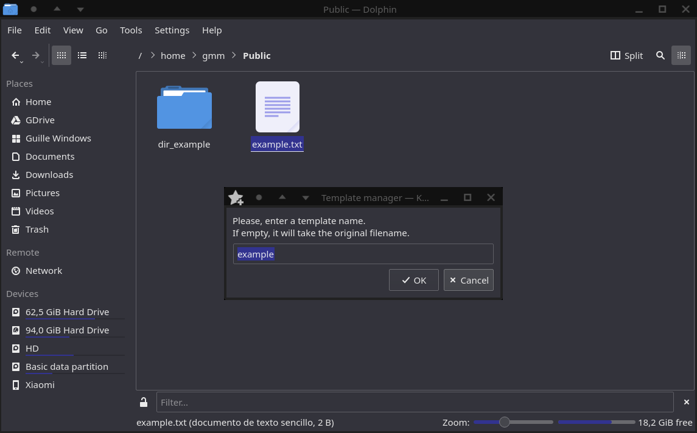

# KDE 5 Template Manager

### KDE 5 Dolphin Service Menu for managing templates.

**Templates** are such a good feature for productivity. They are used to define a unique non-executable
file format intended specifically for a particular application and help us to create that file / directory
automatically. They are supported by Desktop Environments and File Managers used in most of the Linux
distributions.

*KDE 5 Plasma* and *Dolphin* also support it, but you have to create a **.desktop* file manually 
to create the template, which has a difficult syntax to remember. The goal of this project is to 
create a **Dolphin Service Menu for building templates automatically** just by selecting the
desired file / directory, letting the user to choose the different template parameters (name, comments, icon).
It also provides functionality to remove previously created templates by this tool anywhen we want, including
the moment when uninstalling the plugin.

You can template **any file or directory** thanks to this plugin, and it is available in **several languages**: English, 
Spanish, French, Italian, German, Portuguese, Russian, Czech, Polish, Estonian, Romanian, Finish, Swedish, Norwegian,
Turkish, Danish, Ukrainian, Hungarian, Icelandic and Greek languages. Most of them has been translated using Google 
Translator, so some mistakes may appear in texts. If user language is not in the list, English language will be selected 
by default. 

If you want to help me to add support for more languages, you are free to create a Pull Request modifying files 
**TemplateManagerLocalization.sh**, **install.sh** and **uninstall.sh** with the new translations, or you can contact
me by telegram: [@supremoh](https://t.me/supremoh).

## Installation

Download the package, extract it and run the following command to **install** this Dolphin Service. 

    sh ./install.sh

If you don't like it, you can **uninstall** it by running:

    sh ./uninstall.sh

## Usage

It is quite easy to use this plugin. Just select the file you want to use as template, do right-
click and choose the option ***Manage template(s)* -> *Create template...***. Then enter the info asked by the
dialogs that will appear and everything should be ok. Parameters name and icon are required, but
comment is optional. When the template is created, you can use it by doing right-click, select *Create new* menu
and choose the template you want to use.

You can also **delete templates** created with this tool. You just have to do right-click and select 
*Manage template(s)* -> *Remove existing template(s)*. Then, a windows will prompt with all the 
templates, where you can select as many as you want to remove. Finally, confirm, and they will be deleted. 

**It is not recommended removing previous templates** you kept in your disk before you first installed this plugin 
using the template eraser tool, as some bugs may appear and deletion may not work.

